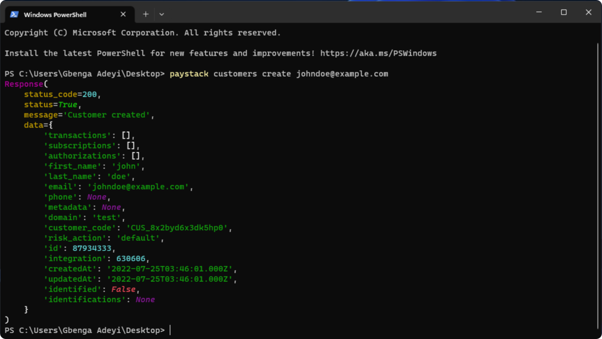

# paystack cli
A command line app for interacting with [Paystack's](https://paystack.com/) API



## Installation
Binaries of paystack cli be found [here](https://github.com/gray-adeyi/kuda-cli/releases/tag/0.1.1). Alternatively, Paystack cli can be installed from pypi
with pip as shown below.
```bash
pip install paystack-cli
```

## First time configurations
You're required to add your paystack auth_key on first use as shown below
```bash
paystack config AUTH_KEY
```
This sets up your paystack cli for use in development mode if the test secret key is used. This auth_key can be
removed with `paystack reset`. Run `paystack --help` to see available commands

## Source code
[https://github.com/gray-adeyi/paystack-cli](https://github.com/gray-adeyi/paystack-cli)